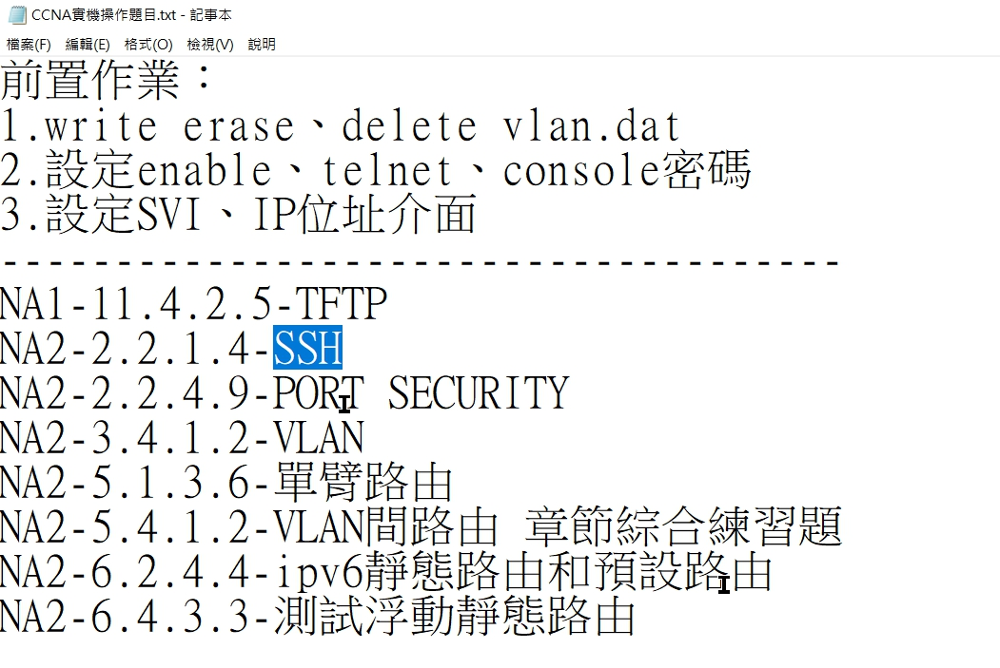

明天 ccna2 ssh
先 pt 再實機


# 速記
11.3
## ping
-  ping default gateway - 確定問題發生在網段內部還是在外部
- baseline 網路基線 - 比較網速的基準點；在不同時間，比較網速

## tracert


## show

常用的有
- show running-config
- show interfaces
- show arp
- show ip route
- show protocols
- show version - 主要看目前使用的 IOS 是哪個檔案 flash : xxx.bin

## 備份

拿到一台機器的第 1 件事就是先備份
- IOS - flash : xxx.bin
	- 先備份第 1 次
	- 還原 default setting
	- 再備份 1 次
- starup-config
- running-config
### 作法
1. console 線及網路線連到設備
2. 用 console 登入
3. `copy xxx.bin tftp` 將檔案透過網路線傳輸出來，檔案位置可以用 `show version` 看

## cdb 協定
易有資安漏洞，沒用到通常會關起來

## tftp
- 通常用來傳設定檔之類的小檔案，不加密，速度快
- UDP 69

11.4.2.5 練習

帳密設定一律固定
帳 cisco
密 ccna


# 交換器、路由器操作
1. 將現有 running, startup-config 及 IOS copy 到 tftp SVR modified中
2. 確認檔案是否存在
3. 還原預設值 
	- write erase
	- **delete vlan.dat** （只有交換器要做）
4. reload
5. 將現有 running-config 及 startup-config copy 到 tftp SVR unmodified中
6. 確認檔案是否存在
7. 設定 enable, telnet, console 密碼、switch-svi, router-ip 位址
8. copy running-config startup-config

## 架構
```
交換器
|--[型號]
	|--modified
		|--running-config
		|--IOS
		|--startup-config
	|--unmodified
		|--running-config
		|--startup-config
	
路由器
|--[型號]
	|--running-config
	|--IOS
	|--startup-config
```


# 保護
將重要檔案隱藏起來，不被別人刪除
- secure boot-image
- secure startup-config
